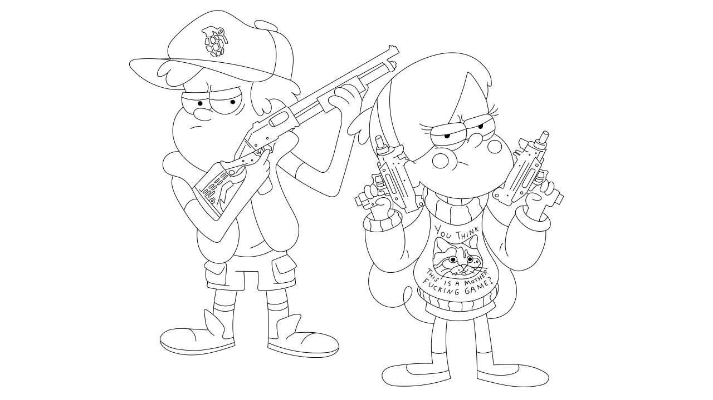
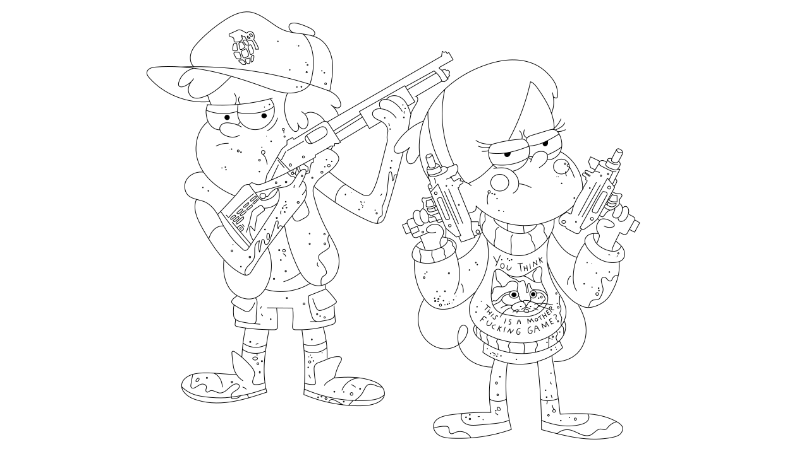

    <h1 id="readme-title-original" align="center">Mabel & Dipper Pines #2 -  - </h1>
    
    <h1 id="readme-title-blood" align="center">Blood version - </h1>
    
    <h4 id="readme-footer" align="center">✏️ with ❤ by <a id="readme-footer-github-link" href="https://github.com/AlexAnimateMP4" target="_blank" title="My Github profile">Alex Animate Mp4</a></h4>

